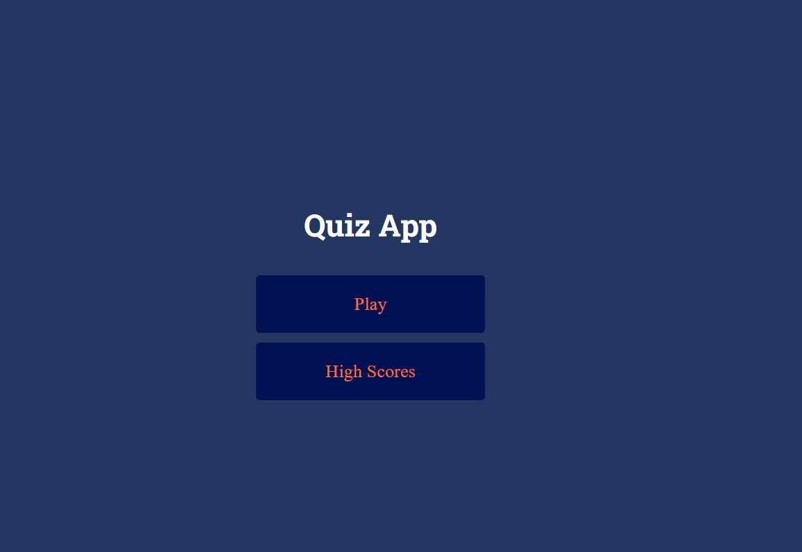
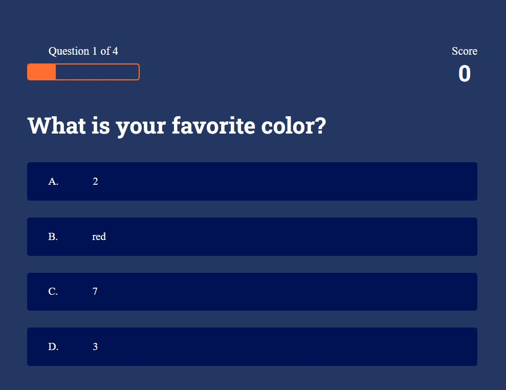
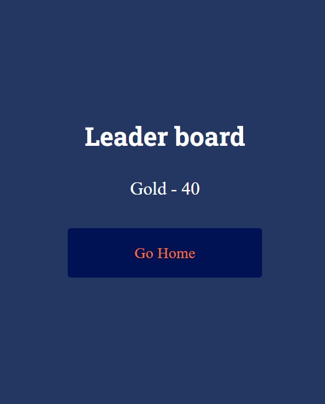

# Quiz APP

## Table of contents

- [Overview](#overview)

  - [The challenge](#the-challenge)
  - [Screenshot](#screenshot)
  - [Links](#links)

  - [Built with](#built-with)

- [Author](#author)

### The challenge

### Screenshot

- Solution URL: [github code]()
- Live Site URL: [netlify live site]()

### Built with

- Semantic HTML5 markup
- CSS custom properties
- Flexbox
- CSS Grid
- Javascript

## Author

- Frontend Mentor - [@goldreb](https://www.frontendmentor.io/profile/goldreb)
- Github - [@goldreb](https://github.com/goldreb)
